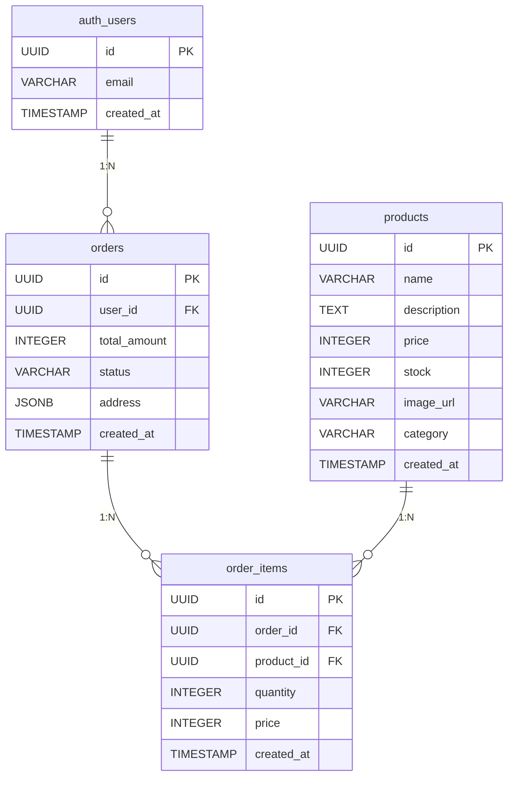

# 要件定義書:rabbit-cart (うさぎECサイト)

## 1. プロジェクト概要

### 1.1 目的
モダンフロントエンド技術(Next.js App Router, TypeScript)の**基礎を体系的に学習**することを目的とした、うさぎモチーフの簡易ECサイト。

### 1.2 学習目標
- ✅ React の基本(コンポーネント、props、state、hooks)
- ✅ Next.js App Router の理解(Server/Client Components の使い分け)
- ✅ TypeScript による型安全な開発
- ✅ Zustand でのシンプルな状態管理
- ✅ Supabase を使ったバックエンド連携(Auth, DB)
- ✅ フォームバリデーション(React Hook Form + Zod)
- ✅ レスポンシブデザイン(Tailwind CSS)

### 1.3 対象ユーザー
うさぎグッズを購入したい一般ユーザー(ログイン必須・任意機能あり)

---

## 2. システム構成・技術スタック

### 2.1 フロントエンド技術

| カテゴリ | 技術選定 | バージョン | 選定理由 |
|:---|:---|:---|:---|
| **UI Library** | **React** | 18.x | UIを構築するための基盤ライブラリ |
| **Framework** | **Next.js (App Router)** | 15.x | Reactフレームワーク、SSR/SSG対応、ファイルベースルーティング |
| **Language** | **TypeScript** | 5.x | 型安全性、エディタ補完、バグ削減 |
| **UI Components** | **Material UI (MUI)** | 6.x | 高品質で統一されたReactコンポーネントライブラリ |
| **Styling** | **Tailwind CSS** | 3.x | ユーティリティファーストCSS、レスポンシブ対応が容易 |
| **State Management** | **Zustand** | 5.x | シンプルで学習コストが低い、persist機能あり |
| **Form Management** | **React Hook Form** | 7.x | 再レンダリングを抑えたパフォーマンスの良いフォーム管理 |
| **Validation** | **Zod** | 3.x | TypeScriptと統合されたスキーマバリデーション、型推論 |

### 2.2 バックエンド技術

| カテゴリ | 技術選定 | バージョン | 選定理由 |
|:---|:---|:---|:---|
| **BaaS** | **Supabase** | Latest | Auth, PostgreSQL, Storage, Realtimeを一括提供 |
| **Database** | **PostgreSQL** | 15.x | Supabaseが提供するリレーショナルDB |
| **Authentication** | **Supabase Auth** | - | メール認証、セッション管理 |
| **Storage** | **Supabase Storage** | - | 商品画像などのファイル保存 |

### 2.3 開発環境・ツール

| カテゴリ | 技術選定 | バージョン | 選定理由 |
|:---|:---|:---|:---|
| **Runtime** | **Node.js** | 20.x LTS | JavaScript実行環境 |
| **Package Manager** | **pnpm** | 9.x | npm/yarnより高速、ディスク効率的、モノレポ対応 |
| **Containerization** | **Docker** | Latest | 環境差異の吸収、再現性の高い開発環境 |
| **Linter** | **ESLint** | 9.x | コード品質チェック、Next.js推奨設定使用 |
| **Formatter** | **Prettier** | 3.x | コードフォーマット統一 |
| **Git Hooks** | **Husky** | 9.x | コミット前の自動チェック(lint, format) |
| **Version Control** | **Git** | - | ソースコード管理 |

### 2.4 デプロイ・ホスティング

| カテゴリ | 技術選定 | 備考 |
|:---|:---|:---|
| **Hosting** | **Vercel** | Next.js開発元、自動デプロイ、エッジネットワーク |
| **Database/Auth** | **Supabase Cloud** | フルマネージド、無料枠あり |
| **CI/CD** | **GitHub Actions** | (オプション)自動テスト・デプロイ |
---

## 3. 機能要件(Functional Requirements)

### 3.1 認証機能(Auth)

#### 対象
全ユーザー

#### 機能詳細

##### 3.1.1 サインアップ(新規登録)
- **画面:** `/signup`
- **入力項目:**
  - メールアドレス(必須、Email形式)
  - パスワード(必須、8文字以上)
  - パスワード確認(必須、パスワードと一致)
- **処理フロー:**
  1. フォームバリデーション(Zod)
  2. Supabase Auth の `signUp` API 呼び出し
  3. 成功時:確認メール送信メッセージ表示 → `/login` へリダイレクト
  4. 失敗時:エラーメッセージ表示(既存ユーザー等)

##### 3.1.2 サインイン(ログイン)
- **画面:** `/login`
- **入力項目:**
  - メールアドレス(必須)
  - パスワード(必須)
- **処理フロー:**
  1. フォームバリデーション
  2. Supabase Auth の `signInWithPassword` API 呼び出し
  3. 成功時:セッション確立 → `/` (商品一覧)へリダイレクト
  4. 失敗時:エラーメッセージ表示

##### 3.1.3 サインアウト(ログアウト)
- **画面:** ヘッダーのログアウトボタン(全ページ共通)
- **処理フロー:**
  1. Supabase Auth の `signOut` API 呼び出し
  2. セッション破棄 → `/login` へリダイレクト

#### 技術的制約
- Supabase Auth を使用(セッション管理は Supabase SDK に委譲)
- Cookie ベースのセッション管理(`@supabase/ssr` 使用)
- パスワードは平文保存せず、Supabase 側でハッシュ化

---

### 3.2 商品閲覧機能(Products)

#### 対象
全ユーザー(未ログインでも閲覧可能)

#### 機能詳細

##### 3.2.1 商品一覧表示
- **画面:** `/` (ルート)
- **表示内容:**
  - 商品カード(画像、商品名、価格)をグリッドレイアウトで表示
  - レスポンシブ:SP(1列)、Tablet(2列)、PC(3-4列)
- **データ取得:**
  - Server Components で Supabase の `products` テーブルから取得
  - `SELECT id, name, price, image_url FROM products ORDER BY created_at DESC`
- **インタラクション:**
  - 商品カードクリック → 商品詳細ページへ遷移

##### 3.2.2 商品詳細表示
- **画面:** `/products/[id]`
- **表示内容:**
  - 商品画像(大)
  - 商品名
  - 価格
  - 商品説明
  - 在庫状況(在庫数 > 0:「カートに入れる」ボタン表示、在庫数 = 0:「売り切れ」表示)
- **データ取得:**
  - Server Components で Supabase から特定商品を取得
  - `SELECT * FROM products WHERE id = {id}`
- **インタラクション:**
  - 「カートに入れる」ボタンクリック → Zustand Store にアイテム追加 → トースト通知表示

#### 技術的制約
- 画像は `next/image` コンポーネントで最適化配信
- Server Components で SSR(Server-Side Rendering)
- 商品データはビルド時に静的生成は**しない**(学習目的のため動的取得)

---

### 3.3 カート機能(Cart)

#### 対象
全ユーザー(ログイン不要、ローカルストレージで永続化)

#### 機能詳細

##### 3.3.1 カートへ商品追加
- **画面:** 商品詳細ページ(`/products/[id]`)
- **処理フロー:**
  1. 「カートに入れる」ボタンクリック
  2. Zustand Store の `addItem` アクション実行
  3. 同じ商品が既にカート内にある場合:数量 +1
  4. ない場合:新規アイテムとして追加(数量:1)
  5. ローカルストレージに自動保存(persist middleware)
  6. トースト通知「カートに追加しました🐰」

##### 3.3.2 カート一覧表示
- **画面:** `/cart`
- **表示内容:**
  - カート内の商品リスト(画像、商品名、単価、数量、小計)
  - 各商品の数量変更ボタン(+/-)
  - 各商品の削除ボタン
  - 合計金額(リアルタイム計算)
  - 「注文へ進む」ボタン(ログイン済みのみ表示、未ログインなら `/login` へ誘導)
- **空カート時:**
  - 「カートは空です🐰」メッセージ
  - 「商品一覧へ戻る」リンク

##### 3.3.3 カート内商品の数量変更
- **処理フロー:**
  1. +/- ボタンクリック
  2. Zustand Store の `updateQuantity` アクション実行
  3. 数量が 0 になった場合:カートから削除
  4. 合計金額を再計算

##### 3.3.4 カート内商品の削除
- **処理フロー:**
  1. 削除ボタンクリック
  2. 確認ダイアログ表示(オプション)
  3. Zustand Store の `removeItem` アクション実行

#### 状態管理の詳細
```typescript
// Zustand Store の型定義イメージ
interface CartItem {
  id: string;
  name: string;
  price: number;
  quantity: number;
  image_url: string;
}

interface CartStore {
  items: CartItem[];
  addItem: (item: Omit<CartItem, 'quantity'>) => void;
  removeItem: (id: string) => void;
  updateQuantity: (id: string, quantity: number) => void;
  clearCart: () => void;
  getTotalAmount: () => number;
}
```

#### 技術的制約
- Zustand の `persist` middleware でローカルストレージに永続化
- ログイン・未ログイン関係なくカートは保持される
- **注意:**サーバー側にカートデータは保存しない(Phase 1 では簡易化)

---

### 3.4 注文機能(Checkout)

#### 対象
ログインユーザーのみ

#### 機能詳細

##### 3.4.1 注文情報入力
- **画面:** `/checkout`
- **アクセス制限:** 未ログイン時は `/login` へリダイレクト
- **入力項目:**
  - 配送先氏名(必須、2文字以上)
  - 郵便番号(必須、7桁、ハイフンなし)
  - 都道府県(必須、セレクトボックス)
  - 市区町村(必須)
  - 番地(必須)
  - 建物名・部屋番号(任意)
  - 電話番号(必須、10-11桁)
- **表示内容:**
  - カート内商品の確認(商品名、数量、小計)
  - 合計金額
  - 配送先入力フォーム
  - 「注文を確定する」ボタン

##### 3.4.2 注文確定処理
- **処理フロー:**
  1. フォームバリデーション(Zod)
  2. Supabase へデータ送信:
     - `orders` テーブルにレコード作成
     - `order_items` テーブルに各商品のレコード作成(トランザクション風に処理)
  3. 成功時:
     - Zustand Store のカートをクリア
     - 完了画面(`/checkout/complete`)へリダイレクト
  4. 失敗時:
     - エラーメッセージ表示(在庫不足、通信エラー等)

##### 3.4.3 注文完了画面
- **画面:** `/checkout/complete`
- **表示内容:**
  - 注文完了メッセージ「ご注文ありがとうございました!🐰」
  - 注文番号(Order ID)
  - 「注文履歴を見る」リンク
  - 「トップへ戻る」リンク

#### バリデーション詳細
```typescript
// Zod スキーマのイメージ
const checkoutSchema = z.object({
  name: z.string().min(2, '氏名は2文字以上で入力してください'),
  postal_code: z.string().regex(/^\d{7}$/, '郵便番号は7桁で入力してください'),
  prefecture: z.string().min(1, '都道府県を選択してください'),
  city: z.string().min(1, '市区町村を入力してください'),
  address: z.string().min(1, '番地を入力してください'),
  building: z.string().optional(),
  phone: z.string().regex(/^\d{10,11}$/, '電話番号は10-11桁で入力してください'),
});
```

#### 技術的制約
- React Hook Form でフォーム管理
- Zod でバリデーションスキーマ定義
- Supabase RLS により、ログインユーザーのみ注文作成可能
- **決済処理は模倣**(実際の決済APIとは連携しない)

---

### 3.5 注文履歴機能(Order History)

#### 対象
ログインユーザーのみ

#### 機能詳細

##### 3.5.1 注文履歴一覧表示
- **画面:** `/orders`
- **アクセス制限:** 未ログイン時は `/login` へリダイレクト
- **表示内容:**
  - 自分の過去の注文リスト(新しい順)
  - 各注文カード:
    - 注文番号
    - 注文日時
    - ステータス(pending, completed 等)
    - 合計金額
    - 「詳細を見る」リンク
- **空の場合:**
  - 「まだ注文履歴がありません🐰」メッセージ

##### 3.5.2 注文詳細表示
- **画面:** `/orders/[id]`
- **表示内容:**
  - 注文番号
  - 注文日時
  - ステータス
  - 配送先情報
  - 注文商品リスト(商品名、数量、単価、小計)
  - 合計金額

#### データ取得
```sql
-- 注文一覧取得
SELECT id, created_at, status, total_amount
FROM orders
WHERE user_id = {current_user_id}
ORDER BY created_at DESC;

-- 注文詳細取得(JOIN)
SELECT 
  o.id, o.created_at, o.status, o.total_amount, o.address,
  oi.quantity, oi.price,
  p.name, p.image_url
FROM orders o
JOIN order_items oi ON o.id = oi.order_id
JOIN products p ON oi.product_id = p.id
WHERE o.id = {order_id} AND o.user_id = {current_user_id};
```

#### セキュリティ
- Supabase RLS により、自分の注文のみ取得可能
- 他人の注文は閲覧不可(403 Forbidden)

---

## 4. データモデル(ER図)

### 4.1 テーブル構成

#### Users(Supabase Auth 管理)
```
auth.users (Supabase 標準テーブル)
- id: UUID (PK)
- email: VARCHAR
- encrypted_password: VARCHAR
- created_at: TIMESTAMP
- ...その他Supabase管理フィールド
```

**アプリからの扱い:**
- 直接操作しない
- `auth.users.id` を外部キーとして参照

---

#### Products(商品マスタ)

| カラム名 | 型 | 制約 | 説明 |
|:---|:---|:---|:---|
| `id` | UUID | PK, DEFAULT uuid_generate_v4() | 商品ID |
| `name` | VARCHAR(255) | NOT NULL | 商品名 |
| `description` | TEXT | | 商品説明 |
| `price` | INTEGER | NOT NULL, CHECK (price >= 0) | 価格(円) |
| `stock` | INTEGER | NOT NULL, DEFAULT 0, CHECK (stock >= 0) | 在庫数 |
| `image_url` | VARCHAR(500) | | 商品画像パス(Supabase Storage) |
| `category` | VARCHAR(50) | | カテゴリ(うさぎぬいぐるみ、うさぎ雑貨 等) |
| `created_at` | TIMESTAMP | DEFAULT now() | 作成日時 |
| `updated_at` | TIMESTAMP | DEFAULT now() | 更新日時 |

**初期データ投入:**
```sql
INSERT INTO products (name, description, price, stock, image_url, category) VALUES
('うさぎぬいぐるみ(白)', 'ふわふわの白うさぎぬいぐるみ', 2980, 10, '/products/rabbit-white.jpg', 'ぬいぐるみ'),
('うさぎマグカップ', 'うさぎイラスト入りマグカップ', 1200, 20, '/products/mug.jpg', '雑貨'),
...
```

---

#### Orders(注文)

| カラム名 | 型 | 制約 | 説明 |
|:---|:---|:---|:---|
| `id` | UUID | PK, DEFAULT uuid_generate_v4() | 注文ID |
| `user_id` | UUID | NOT NULL, FK -> auth.users.id | 注文者ユーザーID |
| `total_amount` | INTEGER | NOT NULL, CHECK (total_amount >= 0) | 注文合計金額(円) |
| `status` | VARCHAR(20) | NOT NULL, DEFAULT 'pending' | ステータス |
| `address` | JSONB | NOT NULL | 配送先情報(JSON形式) |
| `created_at` | TIMESTAMP | DEFAULT now() | 注文日時 |
| `updated_at` | TIMESTAMP | DEFAULT now() | 更新日時 |

**ステータス値:**
- `pending`: 注文確定済み(支払い待ち・処理中)
- `completed`: 完了
- `cancelled`: キャンセル

**address JSONB 構造例:**
```json
{
  "name": "山田太郎",
  "postal_code": "1234567",
  "prefecture": "東京都",
  "city": "渋谷区",
  "address": "神宮前1-2-3",
  "building": "うさぎマンション101",
  "phone": "09012345678"
}
```

---

#### OrderItems(注文明細)

| カラム名 | 型 | 制約 | 説明 |
|:---|:---|:---|:---|
| `id` | UUID | PK, DEFAULT uuid_generate_v4() | 明細ID |
| `order_id` | UUID | NOT NULL, FK -> orders.id | 親注文ID |
| `product_id` | UUID | NOT NULL, FK -> products.id | 商品ID |
| `quantity` | INTEGER | NOT NULL, CHECK (quantity > 0) | 購入数量 |
| `price` | INTEGER | NOT NULL, CHECK (price >= 0) | 購入時単価(円) |
| `created_at` | TIMESTAMP | DEFAULT now() | 作成日時 |

**注意:**
- `price` は注文確定時の商品単価を保存(価格変動対策)
- `products.price` とは独立して保持

---

### 4.2 ER図(Mermaid)



---

### 4.3 Row Level Security (RLS) ポリシー

#### Orders テーブル
```sql
-- SELECT: 自分の注文のみ閲覧可能
CREATE POLICY "Users can view own orders"
ON orders FOR SELECT
USING (auth.uid() = user_id);

-- INSERT: ログインユーザーのみ作成可能(自分のuser_idのみ)
CREATE POLICY "Users can create own orders"
ON orders FOR INSERT
WITH CHECK (auth.uid() = user_id);
```

#### OrderItems テーブル
```sql
-- SELECT: 自分の注文の明細のみ閲覧可能
CREATE POLICY "Users can view own order items"
ON order_items FOR SELECT
USING (
  EXISTS (
    SELECT 1 FROM orders
    WHERE orders.id = order_items.order_id
    AND orders.user_id = auth.uid()
  )
);

-- INSERT: 自分の注文の明細のみ作成可能
CREATE POLICY "Users can create own order items"
ON order_items FOR INSERT
WITH CHECK (
  EXISTS (
    SELECT 1 FROM orders
    WHERE orders.id = order_items.order_id
    AND orders.user_id = auth.uid()
  )
);
```

#### Products テーブル
```sql
-- SELECT: 全員閲覧可能
CREATE POLICY "Anyone can view products"
ON products FOR SELECT
TO public
USING (true);
```

---

## 5. 画面設計

### 5.1 サイトマップ

```
rabbit-cart
│
├─ / (商品一覧) ★全員
├─ /products/[id] (商品詳細) ★全員
├─ /cart (カート) ★全員
├─ /checkout (注文入力) ★ログイン必須
├─ /checkout/complete (注文完了) ★ログイン必須
├─ /orders (注文履歴一覧) ★ログイン必須
├─ /orders/[id] (注文詳細) ★ログイン必須
├─ /login (ログイン) ★未ログインのみ
└─ /signup (新規登録) ★未ログインのみ
```

---

### 5.2 共通レイアウト

#### Header(全ページ共通)
- ロゴ「🐰 rabbit-cart」
- ナビゲーション:
  - 「商品一覧」リンク
  - 「カート」リンク(カート内アイテム数バッジ表示)
  - ログイン済み:「注文履歴」「ログアウト」
  - 未ログイン:「ログイン」「新規登録」

#### Footer(全ページ共通)
- コピーライト「© 2024 rabbit-cart」
- 簡易的な運営情報リンク(オプション)

---

### 5.3 各画面のワイヤーフレーム概要

#### `/` (商品一覧)
```
[Header]
─────────────────────
タイトル: うさぎグッズ一覧🐰

[商品カード] [商品カード] [商品カード]
[商品カード] [商品カード] [商品カード]
...

[Footer]
```

#### `/products/[id]` (商品詳細)
```
[Header]
─────────────────────
[商品画像(大)]  商品名
              価格: ¥2,980
              説明: ふわふわの...
              在庫: 10個
              
              [カートに入れる🐰]

[Footer]
```

#### `/cart` (カート)
```
[Header]
─────────────────────
カート🛒

商品1 [画像] 名前 ¥1,200 × [2] [+][-][削除]
商品2 [画像] 名前 ¥2,980 × [1] [+][-][削除]

─────────────────────
合計: ¥5,160

[注文へ進む]

[Footer]
```

#### `/checkout` (注文入力)
```
[Header]
─────────────────────
注文情報入力

【カート内容】
商品1 × 2 ¥2,400
商品2 × 1 ¥2,980
合計: ¥5,380

【配送先情報】
氏名: [     ]
郵便番号: [     ]
都道府県: [選択]
...

[注文を確定する🐰]

[Footer]
```

---

## 6. 非機能要件

### 6.1 レスポンシブデザイン
- **ブレークポイント(Tailwind CSS):**
  - SP: `< 640px` (デフォルト)
  - Tablet: `md: 768px〜`
  - PC: `lg: 1024px〜`
- **対応:**
  - 商品グリッド:SP(1列)、Tablet(2列)、PC(3-4列)
  - ヘッダーナビゲーション:SP(ハンバーガーメニュー)、PC(横並び)

### 6.2 パフォーマンス
- **画像最適化:**
  - `next/image` コンポーネント使用
  - WebP/AVIF への自動変換
  - Lazy Loading 適用
- **レンダリング戦略:**
  - 商品一覧・詳細:Server Components(SSR)
  - カート:Client Components(Zustand 使用)
  - 認証フォーム:Client Components

### 6.3 セキュリティ
- **認証:**
  - Supabase Auth による安全なセッション管理
  - Cookie ベース、HttpOnly 設定
- **データアクセス:**
  - Supabase RLS でDBレベルのアクセス制御
  - バックエンドAPIは原則不要
- **バリデーション:**
  - クライアント側:Zod(UX向上)
  - サーバー側:Supabase RLS(セキュリティ担保)

### 6.4 アクセシビリティ(基本対応)
- セマンティックHTML使用(`<header>`, `<main>`, `<footer>`)
- ボタンに適切な `aria-label` 設定
- フォーム要素に `<label>` 関連付け
- キーボード操作可能

### 6.5 ブラウザ対応
- **対象ブラウザ:**
  - Chrome(最新版)
  - Firefox(最新版)
  - Safari(最新版)
  - Edge(最新版)
- **IE11 は非対応**

---

## 7. 開発環境・運用

### 7.1 開発環境構築

#### 必要なソフトウェア
- Docker Desktop
- Node.js 20.x (コンテナ内で使用)
- pnpm 9.x
- Git

#### Docker Compose 構成
```yaml
# docker-compose.yml (概要)
services:
  app:
    image: node:20-alpine
    working_dir: /app
    volumes:
      - .:/app
    ports:
      - "3000:3000"
    command: pnpm dev
```

#### セットアップ手順
```bash
# 1. リポジトリクローン
git clone <repository-url>
cd rabbit-cart

# 2. 依存関係インストール
pnpm install

# 3. 環境変数設定
cp .env.example .env.local
# Supabase の URL, ANON_KEY を設定

# 4. Docker コンテナ起動
docker-compose up -d

# 5. 開発サーバー起動
# http://localhost:3000 でアクセス可能
```

### 7.2 環境変数

```bash
# .env.local
NEXT_PUBLIC_SUPABASE_URL=https://xxx.supabase.co
NEXT_PUBLIC_SUPABASE_ANON_KEY=eyJxxx...
```

### 7.3 デプロイ
- **ホスティング:** Vercel(推奨)
- **DB/Auth:** Supabase Cloud
- **CI/CD:** GitHub Actions(オプション)

---

## 8. 学習ロードマップ(Phase 1)

### Week 1:環境構築 & 基礎理解
- [ ] Docker 環境構築
- [ ] Next.js プロジェクト初期化
- [ ] Supabase プロジェクト作成、テーブル作成
- [ ] 商品マスタ初期データ投入

### Week 2:商品閲覧機能
- [ ] 商品一覧ページ(Server Components)
- [ ] 商品詳細ページ(Dynamic Routes)
- [ ] MUI + Tailwind CSS でのスタイリング

### Week 3:認証 & カート機能
- [ ] ログイン・サインアップページ
- [ ] Supabase Auth 連携
- [ ] Zustand でカート状態管理
- [ ] カートページ実装

### Week 4:注文機能
- [ ] 注文入力フォーム(React Hook Form + Zod)
- [ ] 注文確定処理(Supabase への書き込み)
- [ ] 注文履歴一覧・詳細

### Week 5:仕上げ
- [ ] レスポンシブ対応確認
- [ ] エラーハンドリング追加
- [ ] 全体的なリファクタリング
- [ ] Vercel へデプロイ

---

## 9. Phase 2 への発展(将来的な拡張)

Phase 1 完成後、以下を段階的に追加していく想定:

- [ ] URL State での商品検索・フィルタリング
- [ ] `error.tsx` / `loading.tsx` の適切な配置
- [ ] 楽観的UI更新(カート追加時)
- [ ] Server Actions での注文処理
- [ ] TanStack Query 導入(Server State 管理)
- [ ] Supabase Realtime(在庫監視)
- [ ] 無限スクロール

---

## 10. 補足・留意事項

### 10.1 決済処理について
- **Phase 1 では決済APIと連携しない**
- 注文確定 = 「購入模倣」であり、実際の支払いは発生しない
- 将来的に Stripe 等を統合する想定

### 10.2 管理者機能について
- **Phase 1 では管理画面は実装しない**
- 商品の追加・編集は Supabase Dashboard から直接操作
- Phase 2 以降で管理画面を追加予定

### 10.3 テストについて
- **Phase 1 では自動テストは最小限**
- 手動テストで動作確認
- Phase 2 以降で Jest/Vitest によるユニットテスト、Playwright による E2E テスト導入